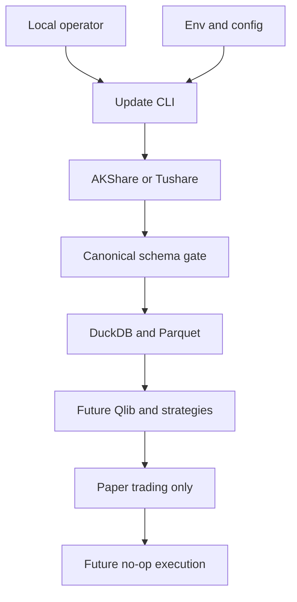

# A-Share Quant Threat Model

更新时间：2026-08-08

## Executive summary

当前系统是 Windows 本地 CLI，不监听网络，也不接入真实券商；最高风险不是远程 RCE，而是研究数据/版本完整性被破坏、Token 泄露，以及未来执行层绕过纸面交易边界。当前代码已经在 `.env` 隔离、SecretStr、外部错误脱敏、bounded retry/backoff、限速、canonical schema、PIT 过滤、原子 Parquet 写入和 `paper`-only 设置上建立控制；依赖锁定、完整财务 PIT 数据、新鲜度门禁和未来 ExecutionProvider 的人工批准仍未完成。

## Scope and assumptions

- In-scope：`scripts/update_data.py`、`src/a_share_quant/config.py`、`src/a_share_quant/contracts/`、`src/a_share_quant/data/`、`src/a_share_quant/storage/`、`.env.example`、`.gitignore`、`config/`、本地 DuckDB/Parquet/日志/报告/模型 artifact 边界。
- Runtime：操作者在本机运行 CLI；AKShare/Tushare 通过出站 HTTP 访问；没有本项目创建的 HTTP listener、RPC、后台服务或券商连接。
- Data sensitivity：行情、股票列表、研究特征和信号属于本地研究数据；Tushare/RQData Token 属于机密；当前没有用户 PII 或多租户数据。
- Future systems：Qlib、VectorBT、RQAlpha、RiceQuant Skills、vn.py 和券商 `ExecutionProvider` 尚未进入 V1 运行路径；真实下单、真实资金、自动实盘和互联网舆情自动交易明确 out of scope。
- Deployment/auth：单机开发/研究目录，不假设远程共享；当前没有应用层认证/授权，文件系统账户和 Git 仓库权限是主要安全边界。

Open questions that would change priorities：

- 如果项目改为团队共享、CI 自动运行或云端服务，需要重新建模身份、密钥托管、租户隔离和远程存储。
- 如果启用真实券商接口或任何自动下单，必须单独批准并重新建模执行、账户权限、人工确认、熔断和审计边界。

## System model

### Primary components

- `scripts/update_data.py`：显式 CLI 入口，读取 `Settings`，构造 provider/store 并运行 `IncrementalUpdater`。
- `AKShareDataProvider` / `TushareDataProvider`：lazy import 外部 SDK，返回 canonical instrument/daily frames；AKShare 包含 Eastmoney/Tencent 日线 fallback。
- `normalization.py`：代码、日期、数值、OHLC、重复键和 point-in-time 过滤。
- `MarketDataStore`：本地 Parquet 数据湖、DuckDB `ingestion_manifest`、原子替换和增量读取。
- `config.py` / `.env`：运行配置和可选 Token；V1 的执行模式强制为 `paper`。
- Future research/paper boundary：设计文件规定 Qlib、VectorBT、RQAlpha、风险层和纸面交易只能通过版本化契约接入，尚未实现真实执行层。

### Data flows and trust boundaries

- Local operator → `scripts/update_data.py`：命令行参数和当前工作目录；进程启动边界；参数使用 `argparse`/ISO 日期解析，网络访问必须显式 `--network-smoke`。
- `.env`/environment → `Settings`：配置和 Token；本地文件/进程环境边界；`SecretStr`、paper-only validator 和 `.gitignore` 是现有控制。
- AKShare/Tushare → provider adapter：HTTP 返回的股票列表、行情和错误；外部网络边界；lazy import、endpoint fallback、canonical schema、日期/数值/OHLC 校验和脱敏 provider error。
- Provider adapter → `MarketDataStore`：pandas canonical frames；进程内模块边界；`normalize_*` 校验代码、日期、范围和重复键，写入使用临时 Parquet 后 `Path.replace`。
- `MarketDataStore` → DuckDB/Parquet：本地文件/数据库边界；manifest 保存 source、日期范围、行数、版本和 quality status；当前依赖本机文件系统权限，没有跨用户授权。
- Data lake → future Qlib/strategy/paper layers：版本化研究边界；设计要求 `as_of`、`announced_at`、`data_version` 和 Signal Schema，但完整财务 PIT bridge 尚未实现。

#### Diagram

## Assets and security objectives

| Asset | Why it matters | Security objective (C/I/A) |
|---|---|---|
| Tushare/RQData Token and `.env` | Could grant data-service access or incur account cost | C/I |
| Canonical Parquet and DuckDB manifest | Research, backtest and signal inputs; tampering changes decisions | I/A |
| PIT/fundamental publication timestamps | Prevents future leakage and false performance | I |
| Strategy/model/feature/data versions | Required to attribute paper trades and reproduce results | I/A |
| Logs, reports and Optuna/model artifacts | Can expose data/credentials or be used to mislead operators | C/I |
| Future paper ledger and risk state | Determines simulated exposure and audit trail | I/A |
| Python dependencies and installed Skills | Supply-chain compromise can execute local code or alter research | I/A |

## Attacker model

### Capabilities

- A local user/process can modify the working directory, `.env`, config, Parquet, DuckDB, logs or installed Python environment if the Windows account is compromised.
- An external data provider, upstream endpoint, DNS/proxy path or compromised package can return malformed, stale or adversarial data.
- A developer or future operator can accidentally add a broker SDK, log a secret, or bypass an adapter unless repository checks enforce the boundary.

### Non-capabilities

- No unauthenticated remote attacker can reach a project listener because V1 creates none.
- No attacker is assumed to control a broker account or real funds in V1.
- No cross-tenant or PII attack is in scope for the local single-user data lake.

## Entry points and attack surfaces

| Surface | How reached | Trust boundary | Notes | Evidence |
|---|---|---|---|---|
| CLI arguments | PowerShell invokes script | Operator → CLI | Dates, provider, limit and explicit network flag | `scripts/update_data.py:main` |
| `.env` and environment | Process startup | Local file → Settings | Token and execution mode | `src/a_share_quant/config.py:Settings`, `.env.example` |
| AKShare/Tushare responses | Outbound provider call | Internet/provider → adapter | Untrusted schema, dates, numeric ranges and status fields | `src/a_share_quant/data/providers/akshare.py`, `tushare.py` |
| Parquet files | Read/write under data root | Provider/process → local lake | File names derive from normalized six-digit symbols | `src/a_share_quant/storage/market_store.py:MarketDataStore` |
| DuckDB manifest | Local database connection | Process → local database | Metadata drives audit and incremental decisions | `MarketDataStore.initialize`, `_upsert_manifest` |
| YAML/config files | Operator/developer edits | Config → runtime | Factor/cost/risk values will affect future decisions | `config/`, `README.md` |
| Future execution adapter | Not active in V1 | Paper signal → broker | Must remain no-op/approval-gated | `docs/superpowers/specs/2026-08-08-framework-first-redesign-design.md` |

## Top abuse paths

1. **Token theft** → local process reads `.env` → token is copied into Git, logs or a report → external data account is abused or access is revoked.
2. **Data poisoning** → provider returns malformed/stale prices or status flags → adapter accepts an unmodeled edge case → Parquet/manifest records become research inputs → candidate ranking and paper PnL are wrong.
3. **Future leakage** → an operator supplies financial values without a trustworthy `announced_at` → feature code treats report period as available date → backtest looks profitable → paper signals are based on unavailable information.
4. **Local integrity overwrite** → a local process edits Parquet or DuckDB between ingestion and research → manifest/version no longer reflects content → backtest and paper ledger cannot be reproduced.
5. **Availability/rate exhaustion** → repeated CLI jobs hit provider endpoints → provider blocks or returns partial data → stale snapshots are mistaken for current data unless quality gates stop downstream signals.
6. **Dependency/Skill compromise** → a compromised package or downloaded Skill executes during install/import/reporting → local files, Token or strategy artifacts are read or modified.
7. **Execution boundary bypass** → future developer imports a broker SDK directly or sets a permissive live flag → a research signal reaches a real account without paper/OOS approval → financial loss.

## Threat model table

| Threat ID | Threat source | Prerequisites | Threat action | Impact | Impacted assets | Existing controls (evidence) | Gaps | Recommended mitigations | Detection ideas | Likelihood | Impact severity | Priority |
|---|---|---|---|---|---|---|---|---|---|---|---|---|
| TM-001 | Local process or accidental commit | Read access to repo or logs | Extract `TUSHARE_TOKEN`/RQData config from `.env`, traceback or report | Account/data-service compromise | Tokens, logs, reports | `.gitignore`; `SecretStr`; provider errors omit payloads; `config.py:enforce_paper_only` | No pre-commit secret scan; filesystem ACL not managed; future reports may contain raw inputs | Add secret scanning to CI/pre-commit; restrict `.env` ACL; redact all report/log fields; rotate on detection | Scan Git diff/history and log artifacts; alert on token-shaped strings | medium | high | high |
| TM-002 | Malicious/stale upstream or proxy | Provider response reaches adapter | Poison fields, dates, status or price ranges | Wrong research/backtest/paper signals | Parquet, manifest, models, paper ledger | `normalize_daily_bars`; required fields; positive prices; OHLC/range checks; duplicate-key replacement; source/version manifest | No independent cross-source reconciliation; quality thresholds not all enforced; raw response cache not versioned | Add schema contracts per endpoint, freshness/row-count checks, cross-source spot checks, quarantine invalid partitions and fail closed | Track quality_status, source drift, empty/partial days and checksum/version changes | medium | high | high |
| TM-003 | Developer/operator or future feature code | Fundamental/valuation data lacks reliable publication time | Use information unavailable at signal date | Inflated historical performance and unsafe paper decisions | PIT timestamps, models, reports, strategy versions | `filter_point_in_time`; design requires `announced_at <= signal_date`; version fields in design | Full fundamental PIT storage/bridge and leakage tests are not implemented in Stage 1 | Make `announced_at` mandatory for fundamental datasets; add time-travel fixtures and fail closed on unknown publication time | Compare feature timestamp to signal timestamp; reject future rows and report leakage counts | medium | high | high |
| TM-004 | Local user/process with write access | Can modify data root or DB | Replace Parquet or DuckDB after manifest update | Reproducibility and signal integrity loss | Data lake, manifest, versions | Atomic temp write + `Path.replace`; manifest source/date/row count/version; ignored local state | No cryptographic checksums, file ACL, or immutable snapshot; DuckDB/Parquet concurrent writers are not coordinated | Store content hash and schema hash; use one writer lock; keep immutable run manifest and backup/rollback policy | Verify hash/row count before research; alert on manifest/file mismatch and unexpected mtime | medium | high | high |
| TM-005 | Upstream or repeated operator jobs | Provider rate limits/proxy instability | Cause repeated failures/partial data and stale signals | Availability loss and stale decision inputs | Data availability, reports, paper monitoring | Incremental skip/local Parquet cache; AKShare primary/fallback; bounded retry/backoff and delay limiter in `AKShareDataProvider`; explicit network flag | No freshness watermark or durable quality event; provider fallback can still return stale/empty data; CLI reports counts only | Add freshness watermark, endpoint response cache metadata and fail-closed downstream gate; persist retry/fallback/empty-response events | Metrics for latency, retries, fallback rate, stale watermark, empty response and provider error class | high | medium | high |
| TM-006 | Compromised package/Skill or dependency drift | Install/import/report process executes third-party code | Read local files, alter models or inject research logic | Local compromise and invalid research | Python env, Token, models, reports | Dependencies/third-party notices; no copied source; optional profiles; official installer | Version ranges are not lockfiles; no hash/signature/license CI yet; Skill scripts may assume Bash/RQData | Generate lockfile with hashes; review upgrades; isolate optional Skills; scan licenses and subprocess calls; pin CI | SBOM/diff, dependency audit, install provenance, unexpected subprocess/network events | low-medium | high | medium |
| TM-007 | Future developer or accidental refactor | Direct broker SDK import or unsafe config change | Bypass `NoopExecutionProvider`, paper gate or manual approval | Real financial loss if scope expands | Account, orders, paper ledger, audit logs | V1 `Settings` rejects live/allow_live; README/design explicitly out of scope; no broker package in core | No static import guard or runtime capability token; future execution adapter not implemented | Add architectural test forbidding broker imports; separate package/profile; require signed config and human approval; default-deny execution API and kill switch | CI grep/import rule; audit every paper order; alert on non-paper mode or broker module load | low now | critical later | medium now / critical if enabled |
| TM-008 | Report/log consumer or source-field injection | Untrusted names/reasons reach future HTML/Markdown renderer | Inject misleading markup or secrets into generated reports | Operator deception or data exposure | Reports, logs, operator trust | Current logging only emits summary counts; provider errors sanitize payloads | QuantStats/Skill report path not yet implemented; no output escaping policy | Escape all source strings for HTML/Markdown, cap field lengths, redact secrets, treat reports as untrusted artifacts | Scan generated HTML for script/secret patterns; retain report metadata and hashes | low now | medium | low now |

## Criticality calibration

- **Critical**：would enable real-money execution or broad credential compromise. Example: a live broker adapter bypassing paper approval; remote service compromise if V1 later exposes an unauthenticated listener. Neither exists in current scope.
- **High**：can systematically corrupt signals/backtests or expose a data-service credential. Examples: TM-001 token theft, TM-002 poisoned data, TM-003 future leakage, TM-004 data/manifest mismatch.
- **Medium**：materially degrades availability or enables a high-impact path only after additional conditions. Examples: TM-005 provider exhaustion, TM-006 dependency compromise, TM-007 future execution bypass while live mode remains disabled.
- **Low**：limited current impact or requires a rare local precondition. Example: TM-008 report markup injection before the report renderer exists.

## Focus paths for security review

| Path | Why it matters | Related Threat IDs |
|---|---|---|
| `src/a_share_quant/config.py` | Secret loading and paper-only execution guard | TM-001, TM-007 |
| `src/a_share_quant/data/providers/akshare.py` | External HTTP boundary, fallback, error handling and provider drift | TM-002, TM-005 |
| `src/a_share_quant/data/providers/tushare.py` | Token-gated optional client and future service terms | TM-001, TM-002, TM-006 |
| `src/a_share_quant/data/normalization.py` | Schema, path-safe symbol, date and PIT integrity controls | TM-002, TM-003, TM-008 |
| `src/a_share_quant/storage/market_store.py` | Atomic writes, DuckDB/Parquet integrity and manifest consistency | TM-004, TM-005 |
| `src/a_share_quant/data/pipeline.py` | Incremental boundary and fail-open/fail-closed behavior | TM-002, TM-005 |
| `scripts/update_data.py` | Operator-controlled network entrypoint and logging | TM-001, TM-005 |
| `docs/superpowers/specs/2026-08-08-framework-first-redesign-design.md` | Future Qlib/RQAlpha/paper/execution trust boundary | TM-003, TM-007 |
| `DEPENDENCIES.md` and `THIRD_PARTY_NOTICES.md` | Dependency and license/supply-chain review record | TM-006 |
| `.gitignore` and `.env.example` | Secret and generated-data exclusion contract | TM-001, TM-004 |

## Notes on use

- This report separates current local CLI behavior from future Qlib, RQAlpha, Skills, vn.py and broker execution. Future integration must trigger a new threat-model review.
- Existing controls are grounded in current files; architecture documents describe intended controls that are not yet implemented and are marked as gaps.
- No secret values were read or written into this report.

## Quality check

- [x] Covered the current CLI, environment, provider, normalization, Parquet, DuckDB and future execution entry points.
- [x] Represented each current trust boundary in the abuse paths/table.
- [x] Separated runtime behavior from tests/dev dependencies and future optional components.
- [x] Recorded the fixed local/paper-only assumptions and open questions that would change risk.
- [x] Listed concrete focus paths and residual gaps.

## Stage 3A security addendum (2026-08-09)

This addendum extends the existing local-CLI threat model to the Stage 3A
baseline manifest, shared contracts, signal-quality report, and promotion gate.
The user-confirmed context remains: single-machine Windows research, outbound
market-data calls only, fixture baseline artifacts currently available, no
broker credentials, and no live execution path.

### New trust boundaries and controls

| Boundary | Evidence | Control |
|---|---|---|
| Stage 2 artifacts -> baseline manifest | `src/a_share_quant/experiments/baseline_manifest.py` | Required artifact checks, config hash verification, content hashes, repository/experiment-root path checks, append-only write behavior |
| Predictions -> Stage 3 contracts | `src/a_share_quant/contracts/stage3.py`, `src/a_share_quant/contracts/timing.py` | Required provenance, finite scores, duplicate-key rejection, timezone-aware signal timestamp, no same-bar execution and T+1 date validation |
| Frozen signals -> analysis/report | `src/a_share_quant/analysis/signal_quality.py`, `src/a_share_quant/analysis/report.py` | Read-only analysis, causal regime calculation, JSON non-finite-value sanitization, explicit fixture/data limitations |
| Gate result -> promotion state | `src/a_share_quant/promotion.py` | Sequential transitions, structural checks, explicit rejection of `LIVE` |
| CLI path arguments -> local files | `scripts/freeze_stage2_baseline.py`, `scripts/run_stage3a_signal_quality.py` | Resolved paths must remain under repository root |

### Stage 3A abuse paths and residual risk

| ID | Abuse path | Priority | Mitigation/status |
|---|---|---|---|
| TM-009 | Local process changes a referenced Parquet file after the manifest is frozen -> signal-quality results use altered data | high | Manifest stores signal/prediction hashes and `verify()` checks them before analysis; filesystem ACLs and immutable remote snapshots remain out of scope |
| TM-010 | Crafted prediction fields contain duplicate keys, non-finite scores, or same-day execution -> optimistic or ambiguous signal is accepted | high | `SignalFrame` rejects malformed provenance, scores, duplicates, timestamps, and execution dates; regression tests cover the boundary |
| TM-011 | Fixture metrics are copied into an investment decision -> synthetic evidence is mistaken for market evidence | medium | Report and README label `data_mode=fixture`; report metadata includes source artifacts and limitations; real-market rerun is still required |
| TM-012 | Future developer adds a live state or broker import -> paper signal can reach real funds | critical if enabled | `PromotionState` rejects `LIVE`, the current project has no broker package, and architecture requires a new threat-model review plus human approval before any such scope change |

### Stage 3A security conclusion

No new remote listener, authentication surface, account token, or live order
route was introduced. The highest current risks are local artifact integrity,
future leakage, and fixture-result misinterpretation. Before Stage 3F paper
monitoring, rerun this review against the ledger/monitor paths and add a static
guard against broker imports.

## Stage 3B security addendum (2026-08-09)

Stage 3B adds only local research boundaries: signal-to-portfolio strategy
translation, an optional VectorBT import boundary, a reference fast-research
engine, and generated fixture reports. It does not add a broker client,
listener, account token, paper ledger, or live execution route.

| Boundary | Risk | Control and evidence |
|---|---|---|
| SignalFrame -> PortfolioStrategy | A malformed or future-dated signal becomes a target weight | `SignalFrame` validates provenance, data mode, timestamps, duplicate keys, and T+1; strategies consume only the public contract |
| PortfolioTarget -> fast research | Approximate fills are mistaken for executable A-share orders | `BacktestResult` records engine, assumptions, limitations, and warnings; the report states that VectorBT/reference results require later event-engine validation |
| Optional VectorBT package -> process | Dependency import or license scope expands the trusted computing base | VectorBT is isolated under `integrations/vectorbt`, optional, unavailable in this run, and not imported by core strategy modules; `DEPENDENCIES.md` records the Commons Clause boundary |
| Fixture artifacts -> operator report | Synthetic returns are mistaken for investment evidence | `data_mode=fixture`, visible `TEST / FIXTURE DATA - NOT INVESTMENT EVIDENCE`, and `SIGNAL_VALIDATED_FIXTURE` promotion state block production interpretation |
| Report payload -> Markdown | Untrusted model/strategy strings could inject misleading report text | Current report fields come from validated local artifacts; future HTML/report rendering must escape source strings and scan for secrets/markup |

Stage 3B review conclusion: no new credential, network listener, or real-money
execution capability was introduced. The remaining high-priority controls are
historical data/benchmark completeness, independent event-engine validation,
and a future static import guard before any broker or paper-monitor stage.

## Stage 3RT-A security addendum (2026-08-09)

Stage 3RT-A introduces a provider-neutral real-time boundary and an in-memory
provisional store. It does not introduce a listener, broker client, account
credential, or live execution state. The user-confirmed deployment remains a
single Windows desktop with outbound provider calls and a future dashboard
bound to localhost only.

| Boundary | Evidence | Control |
|---|---|---|
| Provider response -> real-time contract | `src/a_share_quant/contracts/realtime.py`, `src/a_share_quant/data/realtime/validation.py` | Normalize symbols, require timezone-aware timestamps, reject invalid prices/volume/OHLC, mark stale data, reject future/backwards timestamps |
| Provider factory -> active source | `src/a_share_quant/data/realtime/registry.py` | Capability discovery skips unavailable providers, failover records source/from/to/reason/time, errors omit provider payloads |
| Provisional bars -> historical/PIT data | `src/a_share_quant/storage/realtime_store.py` | Separate in-memory layers; only explicit `finalize_eod` with a reconciler can move final bars |
| `.env` -> runtime configuration | `.env.example`, existing `Settings` paper guard | Credential names only are documented; values remain outside Git and are not present in capability/report objects |

### Stage 3RT-A abuse paths and residual risk

| ID | Abuse path | Priority | Mitigation/status |
|---|---|---|---|
| TM-013 | Stale or future provider timestamps pass into monitoring -> a stale quote is classified as actionable | high | `assess_quote_quality` and `RealtimeCircuitBreaker` mark stale/failed input unusable and block `can_generate_ready`; downstream trigger tests remain required |
| TM-014 | Provider failure silently changes the active source -> operator misreads source quality | medium | `ProviderSwitchEvent` records source transition, exception class and UTC timestamp; dashboard must display the active source and event |
| TM-015 | Provisional intraday bars contaminate historical PIT data -> future research sees unfinalized data | high | `RealTimeStore` has separate provisional/historical maps and explicit idempotent EOD finalization; durable archival/reconciliation is a later sub-stage |
| TM-016 | RQData/Tushare credentials enter logs or reports during capability discovery | high | Provider boundary exposes only booleans, permissions and sanitized messages; no secret value is included in contracts; final launcher/report scan remains required |

Stage 3RT-A conclusion: the new code adds validation and source-switching
controls without adding external inbound exposure or real-money execution. The
remaining risks are provider-specific schema/permission handling and the
dashboard/launcher boundary, which must be reviewed before Stage 3RT-D.

## Stage 3RT-B security addendum (2026-08-09)

Stage 3RT-B adds lazy external adapters, explicit network smoke scripts, a
ReplayRealTimeProvider, and a historical-input readiness check. No SDK token,
broker account, inbound listener, or live execution path was added. The real
smoke attempt was blocked by the configured proxy; the report stores only
provider status, sanitized error type, timestamps, and sample metadata.

| Boundary | Evidence | Control |
|---|---|---|
| Internet/provider response -> adapter | `src/a_share_quant/data/realtime/akshare.py`, `tushare.py`, `rqdata.py`, `normalization.py` | Lazy imports, bounded retry/rate delay/timeout, endpoint capability checks, canonical schema validation, invalid rows skipped rather than fabricated |
| Credentials -> optional adapter | `.env.example`, `build_default_registry`, Tushare/RQData adapters | Credentials are accepted only in memory; capability and health objects contain booleans/statuses, never token/password values; permission failures are cached and excluded from failover |
| Smoke command -> reports | `scripts/run_realtime_smoke_test.py` | `--network` acknowledgement, repository-contained output path, sanitized error type and no raw exception payload; failure is not converted to a success |
| Production historical input -> Stage 2 research | `scripts/run_historical_dry_run.py`, `scripts/update_benchmark.py`, `src/a_share_quant/data/providers/akshare.py` | Fixture symbols are excluded, CSI300 uses explicit `csi000300` mapping, missing benchmark/model artifacts keep status `NOT_READY`, provider failures are logged by type only |

### Stage 3RT-B abuse paths and residual risk

| ID | Abuse path | Priority | Mitigation/status |
|---|---|---|---|
| TM-017 | A provider returns malformed/zero-price rows -> a fake quote enters the real-time monitor | high | Shared normalizer rejects invalid symbols/prices and retains optional fields as null; valid-row count and data-quality status are reported |
| TM-018 | Tushare/RQData permission error is retried continuously -> account/service or provider availability is exhausted | medium | Health probe is cached, permission-denied providers are excluded from failover, retry remains bounded |
| TM-019 | Smoke or benchmark failure traceback leaks URL/payload/token | high | Smoke report records only sanitized error type; benchmark CLI catches and logs symbol plus exception class; raw provider payloads are not written |
| TM-020 | Fixture prediction artifacts are paired with newly downloaded production bars -> false historical evidence | critical for research integrity | Readiness check excludes fixture symbols and blocks while manifest is fixture-only; no historical signal/backtest is emitted |

Stage 3RT-B conclusion: the provider boundary is fail-closed for unavailable
permissions, malformed data, and missing historical evidence. Stage 3RT-C
must additionally keep the runtime and EOD boundaries fail-closed; the
dashboard and launcher surfaces remain for Stage 3RT-D review.

## Stage 3RT-C security addendum (2026-08-09)

Stage 3RT-C adds descriptive intraday analysis, a calendar-aware scheduler,
and an EOD orchestration boundary. It still has no listener, broker client,
account credential, or live execution state.

| Boundary | Evidence | Control |
|---|---|---|
| Minute bars -> intraday features | `src/a_share_quant/features/intraday.py` | Canonical columns are required; optional inputs remain null; group calculations are point-in-time and regression-tested against appended future rows |
| Quote freshness -> monitor trigger | `src/a_share_quant/runtime/scheduler.py`, `src/a_share_quant/signals/realtime.py` | Future/backwards timestamps and stale/failed quality open the circuit boundary; `STALE_DATA` cannot produce `READY`; monitor state is not an order or official signal |
| Clock -> provider polling | `src/a_share_quant/runtime/scheduler.py` | Injectable trading calendar/session resolver blocks lunch, closed, and non-trading requests; retry attempts and backoff are bounded |
| Provisional bars -> official daily signal | `src/a_share_quant/runtime/eod.py`, `src/a_share_quant/storage/realtime_store.py` | Reconciliation and PIT update precede signal generation; any EOD failure returns an empty official-signal result |

### Stage 3RT-C abuse paths and residual risk

| ID | Abuse path | Priority | Mitigation/status |
|---|---|---|---|
| TM-021 | A future or backwards quote makes a stale snapshot look actionable | high | Runtime timestamp tracker and circuit breaker reject the batch; trigger tests assert `STALE_DATA` and no `READY` |
| TM-022 | Scheduler polls an unavailable market session or retries without bound | medium | Session resolver covers lunch/closed/non-trading states; retry policy caps attempts and delay; no background daemon is created by the core runtime |
| TM-023 | EOD signal is generated from provisional/unreconciled data | critical for research integrity | RealTimeStore remains separate; EOD pipeline orders final load, reconcile, PIT update, signal, and report and emits no official signal on failure |

Stage 3RT-C conclusion: monitoring is descriptive and paper-only. The new
runtime rejects unsafe timestamps and unavailable sessions, and the EOD
boundary prevents provisional data from being presented as an official daily
signal. Local dashboard binding, launcher process ownership, and secret/log
scans remain Stage 3RT-D acceptance items.

## Stage 3RT-D security addendum (2026-08-09)

Stage 3RT-D adds a standard-library local HTTP dashboard and Windows launcher
surface. It does not add a broker client, account login, order endpoint, or
remote listener.

| Boundary | Evidence | Control |
|---|---|---|
| Browser -> dashboard | `src/a_share_quant/workbench/app.py`, `tests/test_workbench_app.py` | Server construction rejects every host other than `127.0.0.1`; API responses use no-store headers and expose paper-only status |
| Provider/runtime -> dashboard | `src/a_share_quant/workbench/service.py` | Offline mode skips endpoint calls; provider errors are reduced to exception class/status; no credential field is serialized |
| User shortcut -> process | `scripts/start_quant_workbench.ps1`, `stop_quant_workbench.ps1`, `create_desktop_shortcut.ps1` | Stable launcher path, owned PID file under `.runtime`, local logs, bounded readiness polling, explicit stop target, actual `.lnk` kept outside Git |
| Source tree -> release | `tests/test_launcher_security.py`, repository scans | No `0.0.0.0`, broker import, order call, or live flag path; `.env` and runtime state remain ignored |

### Stage 3RT-D abuse paths and residual risk

| ID | Abuse path | Priority | Mitigation/status |
|---|---|---|---|
| TM-024 | Dashboard is accidentally exposed on a remote interface | critical if enabled | `create_server` rejects non-loopback hosts; regression test covers `0.0.0.0`; launcher URL is loopback-only |
| TM-025 | Launcher reports ready while the process failed or a stale PID is reused | medium | bounded `/api/health` readiness loop, PID existence check, local stderr log, stop script removes only its own PID file |
| TM-026 | Provider exception or secret appears in API/log/report | high | service and provider layers expose sanitized status/type only; secret scan and launcher tests are part of acceptance |
| TM-027 | Operator interprets monitor `READY` as an order | high | dashboard labels paper/signal monitoring, official daily list is separate, no execution module or broker import exists |

Stage 3RT-D conclusion: the local workbench is accepted for paper-only
monitoring with an explicit real-data availability limitation. The boundary
is fail-closed for remote binding, provider failure, and live execution. Any
future broker or external deployment must trigger a new threat-model review,
new human approval, and a separate execution package.
