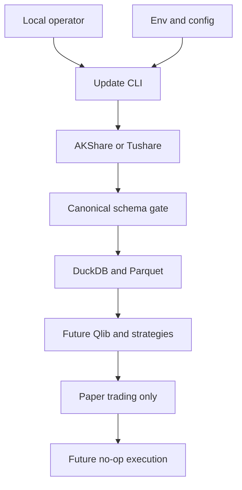

# A-Share Quant Threat Model

更新时间：2026-08-08

## Executive summary

当前系统是 Windows 本地 CLI，不监听网络，也不接入真实券商；最高风险不是远程 RCE，而是研究数据/版本完整性被破坏、Token 泄露，以及未来执行层绕过纸面交易边界。当前代码已经在 `.env` 隔离、SecretStr、外部错误脱敏、bounded retry/backoff、限速、canonical schema、PIT 过滤、原子 Parquet 写入和 `paper`-only 设置上建立控制；依赖锁定、完整财务 PIT 数据、新鲜度门禁和未来 ExecutionProvider 的人工批准仍未完成。

## Scope and assumptions

- In-scope：`scripts/update_data.py`、`src/a_share_quant/config.py`、`src/a_share_quant/contracts/`、`src/a_share_quant/data/`、`src/a_share_quant/storage/`、`.env.example`、`.gitignore`、`config/`、本地 DuckDB/Parquet/日志/报告/模型 artifact 边界。
- Runtime：操作者在本机运行 CLI；AKShare/Tushare 通过出站 HTTP 访问；没有本项目创建的 HTTP listener、RPC、后台服务或券商连接。
- Data sensitivity：行情、股票列表、研究特征和信号属于本地研究数据；Tushare/RQData Token 属于机密；当前没有用户 PII 或多租户数据。
- Future systems：Qlib、VectorBT、RQAlpha、RiceQuant Skills、vn.py 和券商 `ExecutionProvider` 尚未进入 V1 运行路径；真实下单、真实资金、自动实盘和互联网舆情自动交易明确 out of scope。
- Deployment/auth：单机开发/研究目录，不假设远程共享；当前没有应用层认证/授权，文件系统账户和 Git 仓库权限是主要安全边界。

Open questions that would change priorities：

- 如果项目改为团队共享、CI 自动运行或云端服务，需要重新建模身份、密钥托管、租户隔离和远程存储。
- 如果启用真实券商接口或任何自动下单，必须单独批准并重新建模执行、账户权限、人工确认、熔断和审计边界。

## System model

### Primary components

- `scripts/update_data.py`：显式 CLI 入口，读取 `Settings`，构造 provider/store 并运行 `IncrementalUpdater`。
- `AKShareDataProvider` / `TushareDataProvider`：lazy import 外部 SDK，返回 canonical instrument/daily frames；AKShare 包含 Eastmoney/Tencent 日线 fallback。
- `normalization.py`：代码、日期、数值、OHLC、重复键和 point-in-time 过滤。
- `MarketDataStore`：本地 Parquet 数据湖、DuckDB `ingestion_manifest`、原子替换和增量读取。
- `config.py` / `.env`：运行配置和可选 Token；V1 的执行模式强制为 `paper`。
- Future research/paper boundary：设计文件规定 Qlib、VectorBT、RQAlpha、风险层和纸面交易只能通过版本化契约接入，尚未实现真实执行层。

### Data flows and trust boundaries

- Local operator → `scripts/update_data.py`：命令行参数和当前工作目录；进程启动边界；参数使用 `argparse`/ISO 日期解析，网络访问必须显式 `--network-smoke`。
- `.env`/environment → `Settings`：配置和 Token；本地文件/进程环境边界；`SecretStr`、paper-only validator 和 `.gitignore` 是现有控制。
- AKShare/Tushare → provider adapter：HTTP 返回的股票列表、行情和错误；外部网络边界；lazy import、endpoint fallback、canonical schema、日期/数值/OHLC 校验和脱敏 provider error。
- Provider adapter → `MarketDataStore`：pandas canonical frames；进程内模块边界；`normalize_*` 校验代码、日期、范围和重复键，写入使用临时 Parquet 后 `Path.replace`。
- `MarketDataStore` → DuckDB/Parquet：本地文件/数据库边界；manifest 保存 source、日期范围、行数、版本和 quality status；当前依赖本机文件系统权限，没有跨用户授权。
- Data lake → future Qlib/strategy/paper layers：版本化研究边界；设计要求 `as_of`、`announced_at`、`data_version` 和 Signal Schema，但完整财务 PIT bridge 尚未实现。

#### Diagram

## Assets and security objectives

| Asset | Why it matters | Security objective (C/I/A) |
|---|---|---|
| Tushare/RQData Token and `.env` | Could grant data-service access or incur account cost | C/I |
| Canonical Parquet and DuckDB manifest | Research, backtest and signal inputs; tampering changes decisions | I/A |
| PIT/fundamental publication timestamps | Prevents future leakage and false performance | I |
| Strategy/model/feature/data versions | Required to attribute paper trades and reproduce results | I/A |
| Logs, reports and Optuna/model artifacts | Can expose data/credentials or be used to mislead operators | C/I |
| Future paper ledger and risk state | Determines simulated exposure and audit trail | I/A |
| Python dependencies and installed Skills | Supply-chain compromise can execute local code or alter research | I/A |

## Attacker model

### Capabilities

- A local user/process can modify the working directory, `.env`, config, Parquet, DuckDB, logs or installed Python environment if the Windows account is compromised.
- An external data provider, upstream endpoint, DNS/proxy path or compromised package can return malformed, stale or adversarial data.
- A developer or future operator can accidentally add a broker SDK, log a secret, or bypass an adapter unless repository checks enforce the boundary.

### Non-capabilities

- No unauthenticated remote attacker can reach a project listener because V1 creates none.
- No attacker is assumed to control a broker account or real funds in V1.
- No cross-tenant or PII attack is in scope for the local single-user data lake.

## Entry points and attack surfaces

| Surface | How reached | Trust boundary | Notes | Evidence |
|---|---|---|---|---|
| CLI arguments | PowerShell invokes script | Operator → CLI | Dates, provider, limit and explicit network flag | `scripts/update_data.py:main` |
| `.env` and environment | Process startup | Local file → Settings | Token and execution mode | `src/a_share_quant/config.py:Settings`, `.env.example` |
| AKShare/Tushare responses | Outbound provider call | Internet/provider → adapter | Untrusted schema, dates, numeric ranges and status fields | `src/a_share_quant/data/providers/akshare.py`, `tushare.py` |
| Parquet files | Read/write under data root | Provider/process → local lake | File names derive from normalized six-digit symbols | `src/a_share_quant/storage/market_store.py:MarketDataStore` |
| DuckDB manifest | Local database connection | Process → local database | Metadata drives audit and incremental decisions | `MarketDataStore.initialize`, `_upsert_manifest` |
| YAML/config files | Operator/developer edits | Config → runtime | Factor/cost/risk values will affect future decisions | `config/`, `README.md` |
| Future execution adapter | Not active in V1 | Paper signal → broker | Must remain no-op/approval-gated | `docs/superpowers/specs/2026-08-08-framework-first-redesign-design.md` |

## Top abuse paths

1. **Token theft** → local process reads `.env` → token is copied into Git, logs or a report → external data account is abused or access is revoked.
2. **Data poisoning** → provider returns malformed/stale prices or status flags → adapter accepts an unmodeled edge case → Parquet/manifest records become research inputs → candidate ranking and paper PnL are wrong.
3. **Future leakage** → an operator supplies financial values without a trustworthy `announced_at` → feature code treats report period as available date → backtest looks profitable → paper signals are based on unavailable information.
4. **Local integrity overwrite** → a local process edits Parquet or DuckDB between ingestion and research → manifest/version no longer reflects content → backtest and paper ledger cannot be reproduced.
5. **Availability/rate exhaustion** → repeated CLI jobs hit provider endpoints → provider blocks or returns partial data → stale snapshots are mistaken for current data unless quality gates stop downstream signals.
6. **Dependency/Skill compromise** → a compromised package or downloaded Skill executes during install/import/reporting → local files, Token or strategy artifacts are read or modified.
7. **Execution boundary bypass** → future developer imports a broker SDK directly or sets a permissive live flag → a research signal reaches a real account without paper/OOS approval → financial loss.

## Threat model table

| Threat ID | Threat source | Prerequisites | Threat action | Impact | Impacted assets | Existing controls (evidence) | Gaps | Recommended mitigations | Detection ideas | Likelihood | Impact severity | Priority |
|---|---|---|---|---|---|---|---|---|---|---|---|---|
| TM-001 | Local process or accidental commit | Read access to repo or logs | Extract `TUSHARE_TOKEN`/RQData config from `.env`, traceback or report | Account/data-service compromise | Tokens, logs, reports | `.gitignore`; `SecretStr`; provider errors omit payloads; `config.py:enforce_paper_only` | No pre-commit secret scan; filesystem ACL not managed; future reports may contain raw inputs | Add secret scanning to CI/pre-commit; restrict `.env` ACL; redact all report/log fields; rotate on detection | Scan Git diff/history and log artifacts; alert on token-shaped strings | medium | high | high |
| TM-002 | Malicious/stale upstream or proxy | Provider response reaches adapter | Poison fields, dates, status or price ranges | Wrong research/backtest/paper signals | Parquet, manifest, models, paper ledger | `normalize_daily_bars`; required fields; positive prices; OHLC/range checks; duplicate-key replacement; source/version manifest | No independent cross-source reconciliation; quality thresholds not all enforced; raw response cache not versioned | Add schema contracts per endpoint, freshness/row-count checks, cross-source spot checks, quarantine invalid partitions and fail closed | Track quality_status, source drift, empty/partial days and checksum/version changes | medium | high | high |
| TM-003 | Developer/operator or future feature code | Fundamental/valuation data lacks reliable publication time | Use information unavailable at signal date | Inflated historical performance and unsafe paper decisions | PIT timestamps, models, reports, strategy versions | `filter_point_in_time`; design requires `announced_at <= signal_date`; version fields in design | Full fundamental PIT storage/bridge and leakage tests are not implemented in Stage 1 | Make `announced_at` mandatory for fundamental datasets; add time-travel fixtures and fail closed on unknown publication time | Compare feature timestamp to signal timestamp; reject future rows and report leakage counts | medium | high | high |
| TM-004 | Local user/process with write access | Can modify data root or DB | Replace Parquet or DuckDB after manifest update | Reproducibility and signal integrity loss | Data lake, manifest, versions | Atomic temp write + `Path.replace`; manifest source/date/row count/version; ignored local state | No cryptographic checksums, file ACL, or immutable snapshot; DuckDB/Parquet concurrent writers are not coordinated | Store content hash and schema hash; use one writer lock; keep immutable run manifest and backup/rollback policy | Verify hash/row count before research; alert on manifest/file mismatch and unexpected mtime | medium | high | high |
| TM-005 | Upstream or repeated operator jobs | Provider rate limits/proxy instability | Cause repeated failures/partial data and stale signals | Availability loss and stale decision inputs | Data availability, reports, paper monitoring | Incremental skip/local Parquet cache; AKShare primary/fallback; bounded retry/backoff and delay limiter in `AKShareDataProvider`; explicit network flag | No freshness watermark or durable quality event; provider fallback can still return stale/empty data; CLI reports counts only | Add freshness watermark, endpoint response cache metadata and fail-closed downstream gate; persist retry/fallback/empty-response events | Metrics for latency, retries, fallback rate, stale watermark, empty response and provider error class | high | medium | high |
| TM-006 | Compromised package/Skill or dependency drift | Install/import/report process executes third-party code | Read local files, alter models or inject research logic | Local compromise and invalid research | Python env, Token, models, reports | Dependencies/third-party notices; no copied source; optional profiles; official installer | Version ranges are not lockfiles; no hash/signature/license CI yet; Skill scripts may assume Bash/RQData | Generate lockfile with hashes; review upgrades; isolate optional Skills; scan licenses and subprocess calls; pin CI | SBOM/diff, dependency audit, install provenance, unexpected subprocess/network events | low-medium | high | medium |
| TM-007 | Future developer or accidental refactor | Direct broker SDK import or unsafe config change | Bypass `NoopExecutionProvider`, paper gate or manual approval | Real financial loss if scope expands | Account, orders, paper ledger, audit logs | V1 `Settings` rejects live/allow_live; README/design explicitly out of scope; no broker package in core | No static import guard or runtime capability token; future execution adapter not implemented | Add architectural test forbidding broker imports; separate package/profile; require signed config and human approval; default-deny execution API and kill switch | CI grep/import rule; audit every paper order; alert on non-paper mode or broker module load | low now | critical later | medium now / critical if enabled |
| TM-008 | Report/log consumer or source-field injection | Untrusted names/reasons reach future HTML/Markdown renderer | Inject misleading markup or secrets into generated reports | Operator deception or data exposure | Reports, logs, operator trust | Current logging only emits summary counts; provider errors sanitize payloads | QuantStats/Skill report path not yet implemented; no output escaping policy | Escape all source strings for HTML/Markdown, cap field lengths, redact secrets, treat reports as untrusted artifacts | Scan generated HTML for script/secret patterns; retain report metadata and hashes | low now | medium | low now |

## Criticality calibration

- **Critical**：would enable real-money execution or broad credential compromise. Example: a live broker adapter bypassing paper approval; remote service compromise if V1 later exposes an unauthenticated listener. Neither exists in current scope.
- **High**：can systematically corrupt signals/backtests or expose a data-service credential. Examples: TM-001 token theft, TM-002 poisoned data, TM-003 future leakage, TM-004 data/manifest mismatch.
- **Medium**：materially degrades availability or enables a high-impact path only after additional conditions. Examples: TM-005 provider exhaustion, TM-006 dependency compromise, TM-007 future execution bypass while live mode remains disabled.
- **Low**：limited current impact or requires a rare local precondition. Example: TM-008 report markup injection before the report renderer exists.

## Focus paths for security review

| Path | Why it matters | Related Threat IDs |
|---|---|---|
| `src/a_share_quant/config.py` | Secret loading and paper-only execution guard | TM-001, TM-007 |
| `src/a_share_quant/data/providers/akshare.py` | External HTTP boundary, fallback, error handling and provider drift | TM-002, TM-005 |
| `src/a_share_quant/data/providers/tushare.py` | Token-gated optional client and future service terms | TM-001, TM-002, TM-006 |
| `src/a_share_quant/data/normalization.py` | Schema, path-safe symbol, date and PIT integrity controls | TM-002, TM-003, TM-008 |
| `src/a_share_quant/storage/market_store.py` | Atomic writes, DuckDB/Parquet integrity and manifest consistency | TM-004, TM-005 |
| `src/a_share_quant/data/pipeline.py` | Incremental boundary and fail-open/fail-closed behavior | TM-002, TM-005 |
| `scripts/update_data.py` | Operator-controlled network entrypoint and logging | TM-001, TM-005 |
| `docs/superpowers/specs/2026-08-08-framework-first-redesign-design.md` | Future Qlib/RQAlpha/paper/execution trust boundary | TM-003, TM-007 |
| `DEPENDENCIES.md` and `THIRD_PARTY_NOTICES.md` | Dependency and license/supply-chain review record | TM-006 |
| `.gitignore` and `.env.example` | Secret and generated-data exclusion contract | TM-001, TM-004 |

## Notes on use

- This report separates current local CLI behavior from future Qlib, RQAlpha, Skills, vn.py and broker execution. Future integration must trigger a new threat-model review.
- Existing controls are grounded in current files; architecture documents describe intended controls that are not yet implemented and are marked as gaps.
- No secret values were read or written into this report.

## Quality check

- [x] Covered the current CLI, environment, provider, normalization, Parquet, DuckDB and future execution entry points.
- [x] Represented each current trust boundary in the abuse paths/table.
- [x] Separated runtime behavior from tests/dev dependencies and future optional components.
- [x] Recorded the fixed local/paper-only assumptions and open questions that would change risk.
- [x] Listed concrete focus paths and residual gaps.
